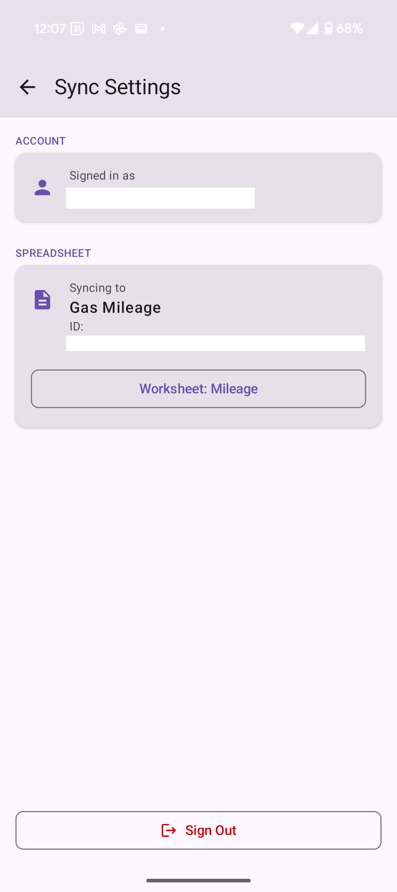

# Lumen

I keep track of the amount of gas filled for my WRX using google sheets. I always wanted to have Google assistant command that could perform the update. This simple application can now listen to voice commands, extract
the arguments and then push it to the google sheet.

```
Hey Google, Use lumen to add gas entry 45 miles 53 gallons and 63 dollars
```

    

## Note
This is a very complicated solution to just build a command that can push data to google sheets. The google assistant is in a limbo with Gemini being pushed. The command fails to send the dollar amount consistently even 
though it does understand it correctly in the UI. I wish there was an easy way :(.
